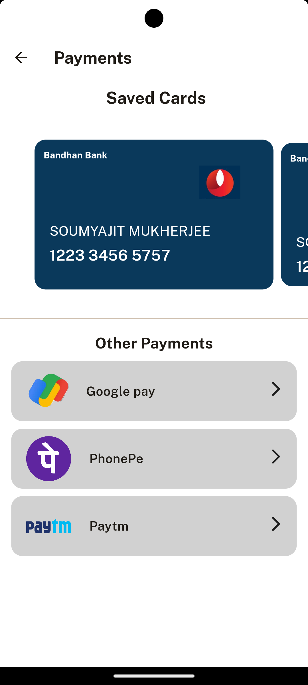

 

  <h1 align="center">Art Cart</h1>

  

    Art Cart is a mobile app that connects artists and art lovers around the world. Art Cart allows artists to showcase and sell their original artworks, such as paintings, sculptures, drawings, photography, etc. Art Cart also allows art lovers to discover and buy unique and affordable artworks from talented and emerging artists.
     
     
    
    ·
    <a href="https://github.com/Sm69mu/Art-cart/issues">Report Bug</a>
    ·
    <a href="https://github.com/Sm69mu/Art-cart/issues">Request Feature</a>
    .
     
     
  

<!-- 
https://user-images.githubusercontent.com/70502672/191589577-7f018b8b-2cd3-4cb8-a9ca-e9ead65466ce.mp4 -->

## ⚠ Note:

### *The application is still under development and this is a pre-release version!*

The current version of the application is a pre-release and is intended to use as a proof of conecpt. Developers assume no liability and are not responsible for any misuse or damage caused by the current version of the application.

## App Screenshots:

### Login / Signup:
      

### Home Page:
  

 

### Categories Page:
 

### Cart Page:
 

### Account details & Payments Page:
 
 

## Built With

* 

* 

(<a href="#readme-top">back to top</a>)

## How to use:

Head over the releases tab for this project and download the (.apk) file for the latest release.

(<a href="#readme-top">back to top</a>)

## Contributing

Contributions are what make the open source community such an amazing place to learn, inspire, and create. Any contributions you make are **greatly appreciated**.

If you have a suggestion that would make this better, please fork the repo and create a pull request. You can also simply open an issue with the tag "enhancement".
Don't forget to give the project a star! 

(<a href="#readme-top">back to top</a>)

<h1 align="center"> Thank You 

